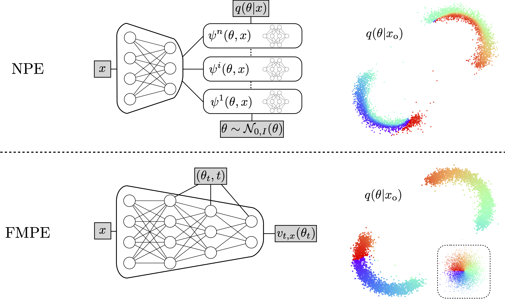

# Flow-Matching-Posterior-Estimation

This is the companion repository for the NeurIPS-2023 paper [Flow Matching for Scalable 
Simulation Based Inference](https://neurips.cc/virtual/2023/poster/72395), which 
introduces a simulation-based inference (SBI) method based on flow matching, called FMPE.
It contains code to run the experiments for an SBI benchmark and gravitational wave 
inference as a challenging real world example.

This repository builds on the [dingo](https://github.com/dingo-gw/dingo) package for the
implementation of the base methods for flow matching and the pipeline for the GW 
experiment.



# Set up
First, clone the [FMPE](https://github.com/dingo-gw/dingo/tree/FMPE) branch of the 
`dingo` repository.

```sh
git clone --branch FMPE https://github.com/dingo-gw/dingo.git
```

Next, create a new virtual environment.

```sh
python3 -m venv fmpe-venv
source fmpe-venv/bin/activate
```

Install `dingo` in this environment.

```sh
cd dingo
pip install -e ."[dev]"
```

Note that while `dingo` can in general be installed from 
[PyPI](https://pypi.org/project/dingo-gw/) with pip, this manual installation is required 
as the FMPE code is not yet contained in the main branch. 

Finally, install the [sbibm](https://github.com/sbi-benchmark/sbibm) package for the 
benchmark experiments.

```sh
pip install sbibm
```

# Experiments

## SBI Benchmark 

Training and evaluation scripts available in `./sbi-benchmark`. To train an FMPE model,
run

```sh
python run_sbibm.py --train_dir </path/to/train_dir>
```

where the training directory contains a `settings.yaml` file. Example settings can be 
found in `./sbi-benchmark/settings.yaml`.

## Gravitational Wave inference

We here provide a full inference example for the real GW event 
[GW150914](https://journals.aps.org/prl/abstract/10.1103/PhysRevLett.116.061102).
This builds on the full dingo pipeline, although it applies some simplifications (e.g.,
no full noise conditioning).

This example follows the steps from the 
[dingo NPE tutorial](https://dingo-gw.readthedocs.io/en/latest/example_npe_model.html).
To run this, navigate to the `./gravitational_waves` directory and follow the 
instructions below.

### 1. Generate a waveform dataset
We first generate a dataset of GW polarizations, which is later used to train 
the model.

```sh
dingo_generate_dataset --settings datasets/waveform_dataset_settings.yaml --out_file 
datasets/waveform_dataset.hdf5 --num_processes 8
```

The number of processes should be adjusted to the number of available CPU cores.

### 2. Generate an ASD dataset
To train Dingo, one needs to provide an estimate for the detector noise amplitude 
spectral density (ASD). For simplicity, we provide a dataset in 
`./datasets/asd_dataset_GW150914.hdf5`, so this step can be skipped.

### 3. Train the Dingo network

Once the datasets are available, we train the FMPE network.

```sh
dingo_train --settings_file training/train_settings.yaml --train_dir training
```

Depending on the available resources some settings may need to be adjusted. This includes

* `model/...` for the size of the model,
* `local/num_workers` for number of workers (set this to number of 
  available CPU cores -1; dingo requires some heavy preprocessing, so if this number 
  is too low, it may become the bottleneck),
* `local/device` for the accelerator (typically `cuda`, `cpu` is also possible, but 
  extremely slow) and
* `training/stage_0/batch_size` for the batch size (reduce this if you run out of 
  memory).


Please also refer to the documentation: https://dingo-gw.readthedocs.io.


# References

```bibtex
@inproceedings{wildberger2023flow,
    title={Flow Matching for Scalable Simulation-Based Inference},
    author={Jonas Bernhard Wildberger and Maximilian Dax and Simon Buchholz and Stephen R Green and Jakob H. Macke and Bernhard Sch{\"o}lkopf},
    booktitle={Thirty-seventh Conference on Neural Information Processing Systems},
    year={2023},
    url={https://openreview.net/forum?id=D2cS6SoYlP},
    eprint={2305.17161},
    archivePrefix={arXiv},
    primaryClass={cs.LG},
}
```

If you use the dingo code for the GW example, please also cite the following (and 
refer to the Reference section of the 
[dingo README](https://github.com/dingo-gw/dingo#references) for other optional 
citations).

```bibtex
@article{Dax:2021tsq,
    author = {Dax, Maximilian and Green, Stephen R. and Gair, Jonathan and Macke, Jakob H. and Buonanno, Alessandra and Sch\"olkopf, Bernhard},
    title = "{Real-Time Gravitational Wave Science with Neural Posterior Estimation}",
    eprint = "2106.12594",
    archivePrefix = "arXiv",
    primaryClass = "gr-qc",
    reportNumber = "LIGO-P2100223",
    doi = "10.1103/PhysRevLett.127.241103",
    journal = "Phys. Rev. Lett.",
    volume = "127",
    number = "24",
    pages = "241103",
    year = "2021"
}
```
